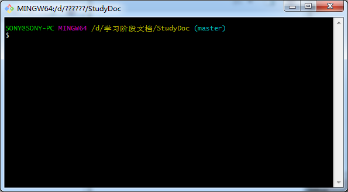
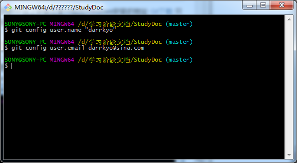
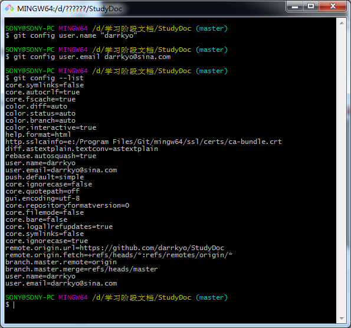
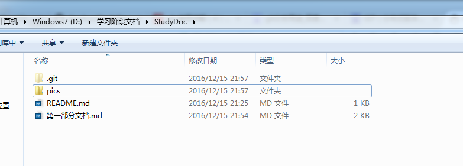
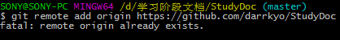

# Git的学习
##1.什么是Git
   Git是一个开源的分布式版本控制系统，可以有效、高速的处理从很小到非常大的项目版本管理。可以通过分支对已经稳定的master中的代码进行同时的开发和测试，并在分支稳定之后可以直接merge到master分支直接进行发布，极大的推动了合作开发和开源项目的制作。
##2.安装Git
   Git可以在不同的平台上安装这里只给出Windows安装的地址

   [Git下载](http://code.google.com/p/msysgit)
   只需要简单的安装就可以完成
##3.初次运行Git
   可以在开始里面点击Git Bash或者在你想要创建Git仓库的地方右键选择Git Bash Here进入git操作栏

   

   第一次进入Git时候需要对一些信息进行配置首先是需要对用户信息进行配置

	$ git config user.name "darrkyo" 

	$ git config user.email darrkyo@sina.com

   

   配置之后可以使用

	git config --list
   命令对配置信息进行查看 

   

   这里会显示出你所有的配置信息
   如果有疑问可以使用
	
	$git --help
   命令进行帮助菜单的调出

   

   到这里Git的准备就基本完成了 接下来就可以使用Git对代码进行保存了
##4创建Git本地仓库
   要对某个项目使用Git进行管理的话，需要在该项目所在的目录执行

	$ git init
   命令，执行之后就将该目录变成Git仓库，同时还会生成一个.git的目录

   

   由于我的目录已经创建完成，显示已经存在Git库而在文件夹内的.git文件夹是隐藏的，需要显示才可以看到

   

   这样Git本地的仓库就创建完成了
##5使用Git上传文件
   这里首先要说一下Git文件的几种状态
   Git的文件分为‍‍已提交（committed），已修改（modified）和已暂存（staged）三种状态，三种文件分别存在Git 的工作目录，暂存区域，以及本地仓库当中
  
   而Git的工作流程是如下的
   
   在工作目录中修改某些文件。

   对修改后的文件进行快照，然后保存到暂存区域。

   提交更新(commit)，将保存在暂存区域的文件快照永久转储到 Git 目录中。

   首先我要们链接远程仓库 我们使用

	 $git remote add origin https://github.com/darrkyo/StudyDoc
   
 

   由于我先前已经链接成功所以显示已经存在命令来添加远程仓库添加完成之后我们可以使用
	
	$git show origin master
   来查看所有远程链接 并且会显示出有变化的文件

   我们可以使用
	
	$git status
   命令来查看文件的状态

   

   这里由于我的文件刚刚编辑完成所以显示成为红色对应modified状态
   接下来需要执行

	$git add
    $git add -A
   命令对文件进行跟踪然后查看文件状态

   

   这里已经改动的文件变成绿色了就代表已经被跟踪 接下来我们执行

	$git commit “文件名”
    $git commit --all
    $git commit -m “信息”
   对文件进行暂存

  

   可以看到上面改动的文件都已经被暂存 我们再可以看一下文件状态

   

   由于创建了新的文件所以显示还有红色 可以经常使用

	$git status
   来查看文件的状态
   在commit之后就可以使用

	$git push
   命令来进行提交

   

   首先会让你输入的用户名来确定传到GitHub的账户名字

   

   然后再让你输入密码

   

   然后我们的文件就上传成功了！
##6从远程仓库获取文件
   从远程仓库获取文件有几种方式
   首先是克隆仓库
	
	$ git clone https://github.com/darrkyo/StudyDoc
   可以从远成仓库clone一个完整的项目下来
   
   然后是pull 每提交项目之前最好pull一下
   pull是将远成仓库的最新文件下载到本地

   

   由于远程仓库与本地没有区别所以显示所有文件都是最新
   
   如果pull下载的文件有差别可以先使用

	$git merge
   命令对差异进行合并
##7常见错误
   本地commit了但是没有保存 
   
    需要执行$git rebase origin master 然后编辑信息重新commit才会成功

   push时候提示out of date
 
	需要先进行$git pull命令之后在push

##8Git和Intellij Idea
   这里我们把开发使用的IDE和Git结合，Intellij Idea本身是自带Git的，但是我们为什么需要换成自己的呢？

   这是因为Intellij Idea自带的Git功能不全，仅有几个简单的功能，所以我们要换成自己已经搭建完成的Git，步骤如下

**1.打开设置Setting**

   

**2.搜索Git**

   

   在这里把地址修改成本地下载好的Git.exe的目录点解接受
   这样我们就将本地的Git整合到Intellij Idea当中了

##9上传项目

   首先，我们的项目是没有生成Git本地库的，所以我们需要先让他变成一个Git本地库
    
   我们首先菜单里面的VCS项下面的Import into Version Control项的Create Git Reponsitory    

   

   这里选择我们自己的项目点击确定，这样我们的项目就已经变成一个Git本地库了

   

   在项目的右键菜单里面我们已经可以看到Git的选项了

   

   而项目目录我们也可以看到有文件变成红色了，说明该文件还没有被Git跟踪，接下来的步骤就跟Git Bash类似了
   
   

   我们点击右键菜单Git里面的Add将文件跟踪

   

   然后我们点击菜单里面的Commit Directory将文件暂存

   

   弹出窗口是显示你要commit的文件，箭头位置是填写commit信息的

   

   然后我们就可以正常的Push和Pull操作了！

   

##10克隆项目

   我们可以上传项目，我们也可以从Git仓库上直接克隆一个项目到本地
   首先我们点击VCS菜单下面的Checkout from Version Control选项下面的Git

   

   然后就会弹出一个对话框，蓝色箭头位置填写的是要克隆的在线仓库，红色箭头位置填写你项目的名称，点击clone之后我们就可以从在线仓库克隆一个项目到本地了！

   