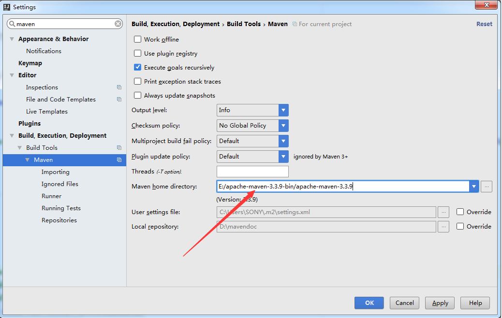

#1.Maven
###什么是Maven？
   
   Maven是一个项目管理工具，通过一个xml文件来管理项目的搭建
###如何搭建Maven

   Maven的搭建有两种方式，一种是本地搭建，一种是结合IDE搭建 这里我们先介绍第一种方法
##本地Maven搭建

   **1.首先去官网下载[Maven ](http://www.apache.org/dyn/closer.cgi/maven/binaries/apache-maven-3.0.4-bin.tar.gz)**

   **2.下载解压之后需要配置环境变量**
   
   系统变量：MAVEN_HOME = 文件地址\apache-maven-3.0.4

   系统变量：path = %MAVEN_HOME%\bin

   然后打开cmd  输入mvn -version如果配置成功则会出现以下的文字

   

   **3.修改Maven本地仓库的位置**

   找到安装目录下面的conf文件夹内的settings.xml文件

   

   找到该行，然后把localRepository修改成你要指定的文件夹，这样Maven的本地仓库位置就修改好了
##依赖IDE搭建Maven
   这里我们使用的IDE是**Intellij Idea**

   **1.去官网下载[Intellij Idea](https://www.jetbrains.com/idea/#chooseYourEdition)**

   Community版本是免费的，功能比较少

   Ultimate版本收费但是功能强大，这里我们选择Ultimate版本，激活码可以去网上搜索

   安装这里就不做赘述，我们直接开始搭建Maven

   **2.Intellij Idea搭建Maven**

   1.打开Intellij Idea后找到设置Setting

   

   2.选择Setting之后搜索Maven
 
   

   3.将Maven版本换成刚才下好的版本点击确定

   

   这样IDE就使用的是我们刚才下好的Maven而不是自带的了，现在可以创建项目了！

##创建Maven项目

   首先我们创建一个新的项目

   

   在弹出的窗口内我们选择Maven项目，在右上角选择你的jdk版本，这里我选择的1.8版本

   

   GroupId是确定你的项目属于哪一个组，这里我们暂且随便写一个就好

   ArtifactId填写你的项目名称

   版本号为默认即可

   

   这里填写你的项目名称

   

   这样我们的Maven项目的就搭建成功了！ 项目结构如下

   

   pom.xml即为管理文件，需要的文件我们就可以在此添加，右下角提示新的Maven项目需要引入，这里我们选择Import Changes就好

   

   到这里我们Maven结合IDE搭建并创建项目就完成了！
    