#WCM

##什么是WCM

   WCM是TRS公司制作的内容协作平台，该平台提供了基于JAVA和浏览器的内容管理平台，在该平台上可以实现对浏览器界面的内容创建、维护和基于模板的内容发布，具有强大的站点管理功能。

##WCM基本概念

   **库**

   相同类型站点的集合，分为文字库、图片库、视频库和资源库

   **站点**

   WCM系统里最主要的对象，负责组织和管理栏目。一个站点相当于一个网站，可以按照网站的结构来设计站点及栏目

   **栏目**

   站点的下一级管理单元，用来组织和管理文档。栏目的存在必须要依附于站点，没有站点就不能建立栏目

   **文档**
   
   WCM的基本单元，也是系统的核心数据内容。系统中的每一篇文档都必须建立在某个栏目下，有具备特定权限的用户来操作和管理

   **模板**
   
   带有TRS置标的HTML文件，用来控制发布页面的显示。系统的站点、栏目、文档都可以分别配备不同类型模板

   **发布**

   将系统中的数据结合模板置标生成HTML页面的过程。设置了完整发布属性的站点、栏目和文档都可以执行发布操作

   **预览**

   在对象发布之前，通过预览功能可以提前查看站点、栏目和文档发布后的效果

##WCM的使用

   安装部分这里就不做陈述，用户可以根据自己的系统参照手册来对WCM进行安装

   首先我们点击桌面的图片开启WCM服务

   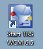

   程序启动完成之后

   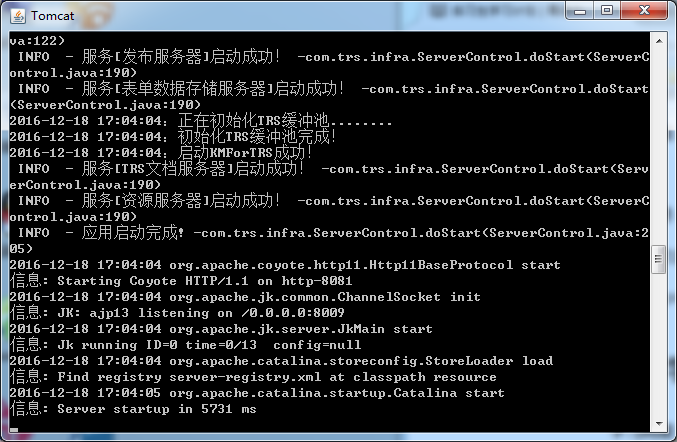

   我们打开网页，在浏览器输入地址
	
	http://127.0.0.1:8081/wcm

   打开程序,弹出登录界面

   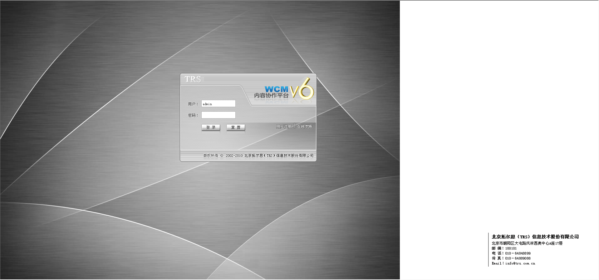

   输入密码之后进入主界面

   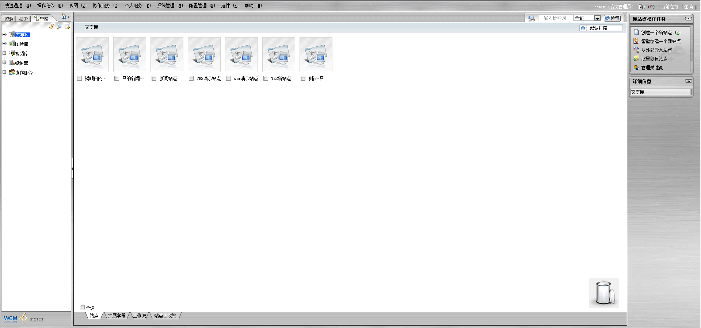
   
   在这里我们能看到整个系统的主页，接下来，我们开始最基础的建站操作

   **1.创建一个站点**

   在文字库的下面右键，选择新建一个站点，然后弹出站点新建窗口

   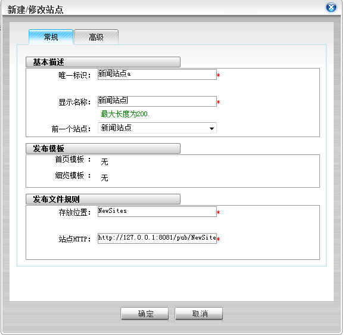

   在这窗口里的

   唯一标识为该站点的ID，是必须唯一的
   
   显示名称为该站点显示时候的名称

   存放位置是该站点存放的文件夹名称

   站点HTTP是网络操作时候该站点的地址

   填写完成之后点击确定，然后我们就可以在库内看到我们刚才新建的站点了

   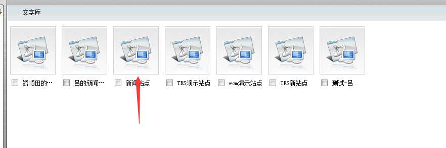

   **2.创建一个栏目**
   
   双击进入站点之后，我们需要为我们的站点创建一个栏目，相当于一个表单页面，对一部分的信息进行汇总，在站点内右键选择新建一个栏目

   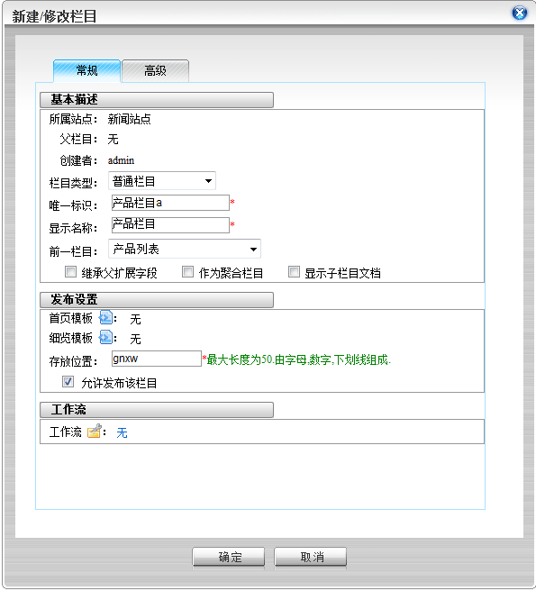

   同样的，该窗口内的

   唯一标识为该栏目的ID，是必须唯一的
   
   显示名称为该栏目显示时候的名称

   存放位置是该栏目存放的文件夹名称

   填写完毕之后点击确定就可以看到我们新建的栏目

   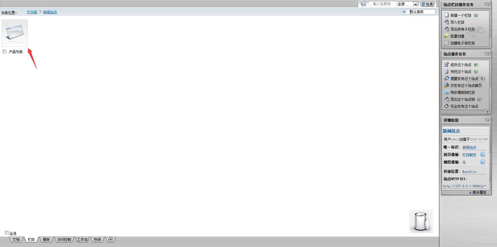

   **3.创建一个文档**
   
   接下来，我们需要为我们的栏目创建一个文档，相当于表单页面内的物品详细页，我们点击下面的文档栏

   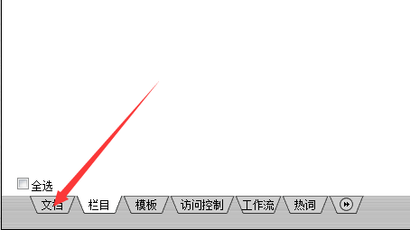
 
   然后右键新建一个文档，选择要存放的栏目

   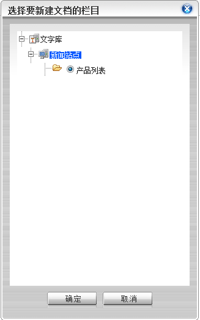

   这里我们选择刚刚创建的产品列表栏目，点击确定弹出文档编辑页面

   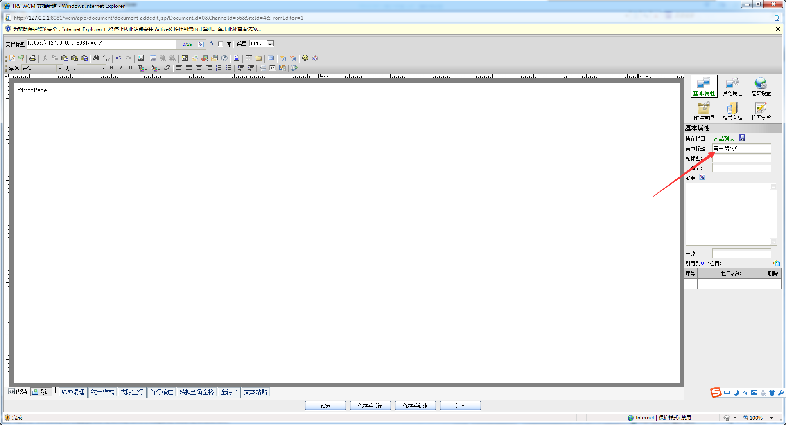

   该页面可以编写文档信息，然后在右边箭头处填写文档标题，单击确定键我们的文档就创建好了

   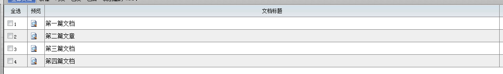

   **4.创建模板**

   模板有四种：分别是概览、细览、嵌套、表单，这里我们主要使用一下概览和细览的模板

   概览模板是调整站点或者栏目的布局

   细览模板则主要是对文档的内容布局进行调整

   接下来我们创建一个概览模板，首先点击下面菜单里面的模板项

   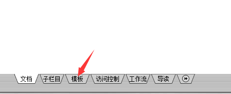

   然后右键点击新建一个模板

   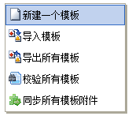

   弹出模板窗口，在模板名称填上你的名称，然后选择模板类型，这里我们选择概览模板

   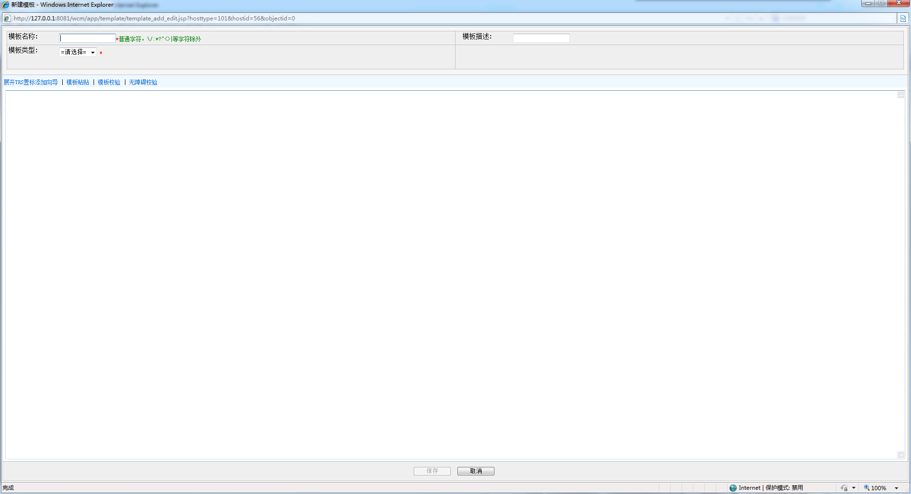

   然后选择展开TRS置标导航，置标是可以通过关键字获取值的一段代码

   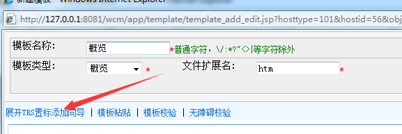

   由于我们创建了一个概览模板，这里我们选择文档列表

   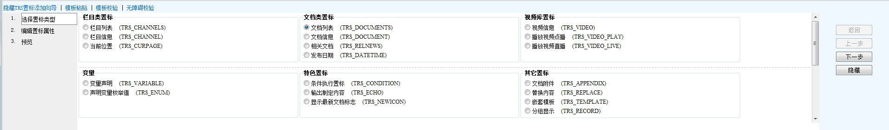

   然后选择插入到光标处

   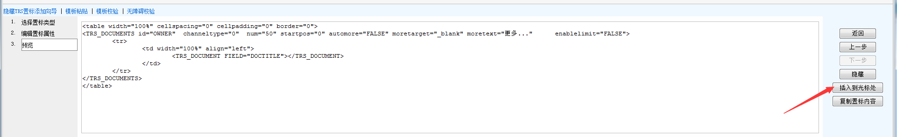

  然后就发现刚才生成的代码被插入到文档里面了

   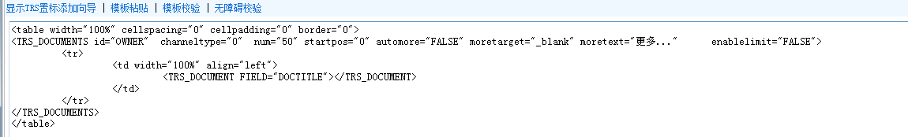
 
  最后点击保存，我们就能看到一个简单的模板了

   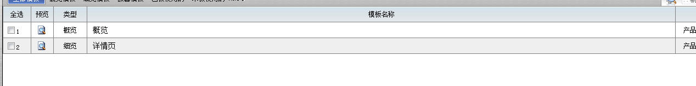

  细览模板的创建跟这个相同，只是里面的置标选择不同

 **5.应用模板**

  创建模板之后需要将模板绑定到栏目或者文档上，就可以进行预览，我们点击右边菜单里面的图标

  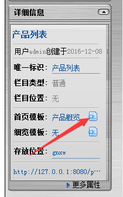

  进入设置模板页面

  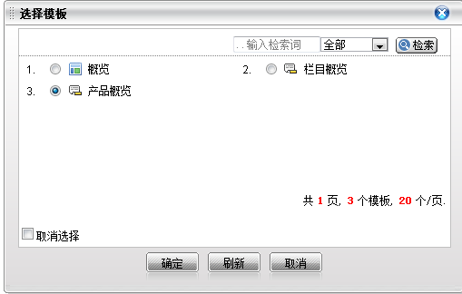

  选择刚才建立的模板，点击确定之后，模板就已经被设置到栏目上了！

**6.发布和预览**

 我们刚才的改动需要发布到后台，才可以进行使用，这里我们选择我们的项目然后右键选择发布

  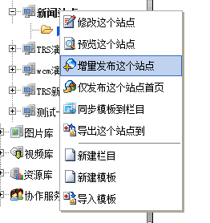

  同样，对我们新编的文档也是需要发布的，在文档上右键点击发布

  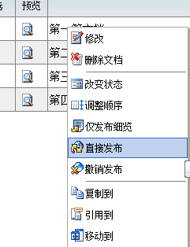

   然后发现文档右边的状态编程已发之后就是已经发布到后台，我们现在就可以使用了！

   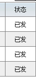

   预览了可以在我们发布之前看到发布之后的状态，在项目上右键点击预览之后就可以看到我们自己建设的网页

   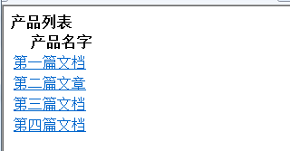

   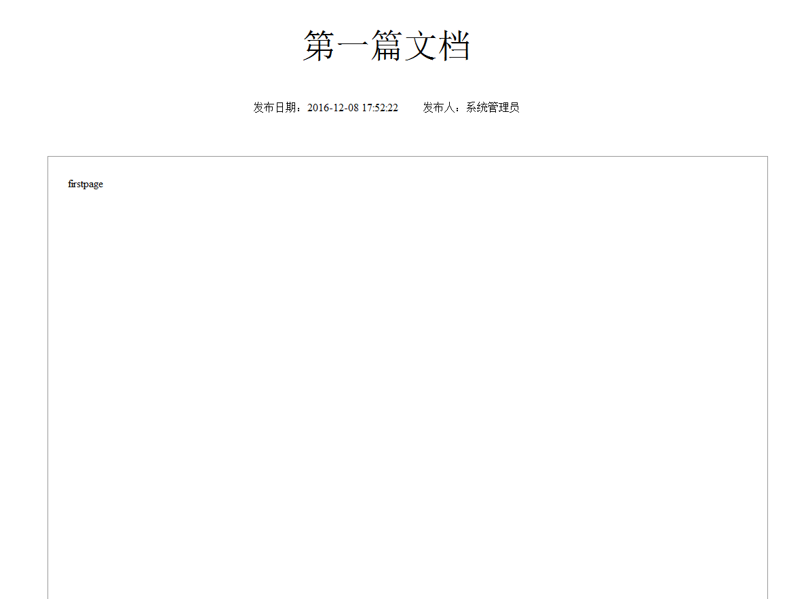