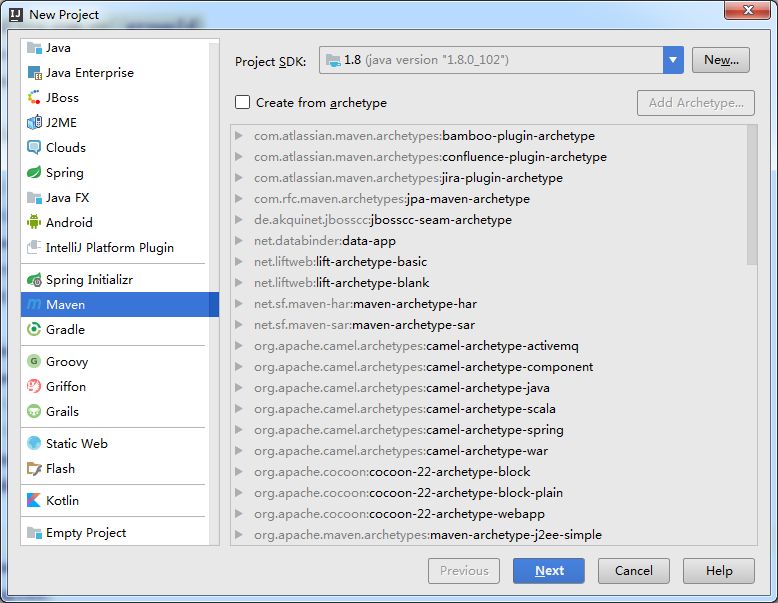
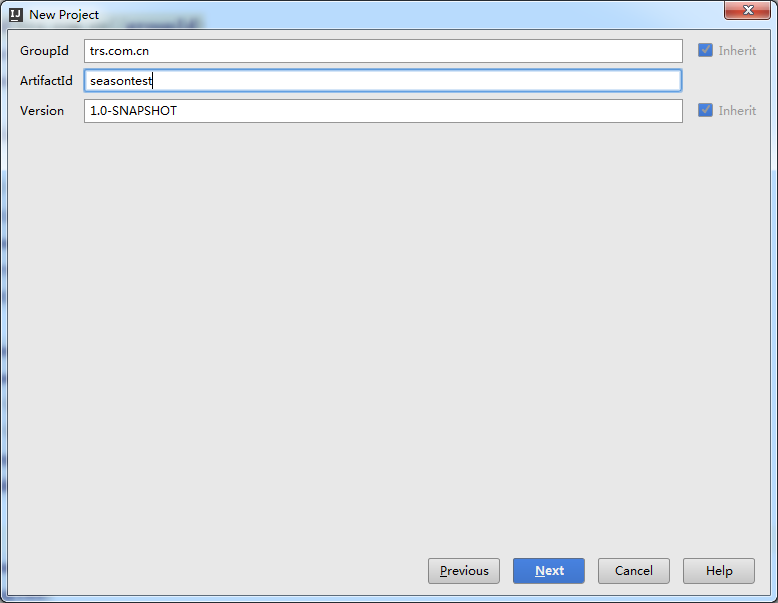
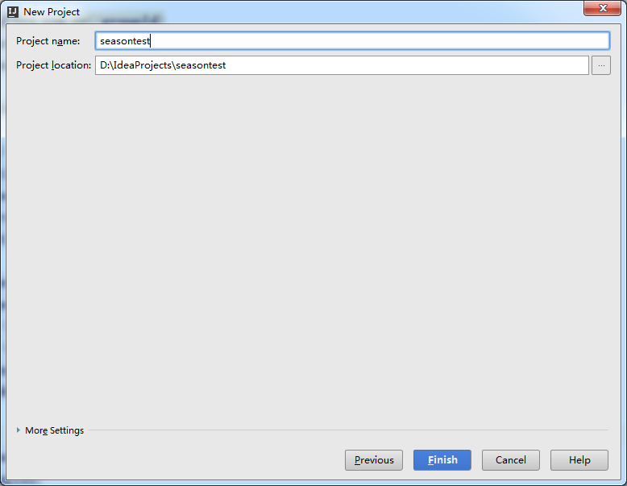
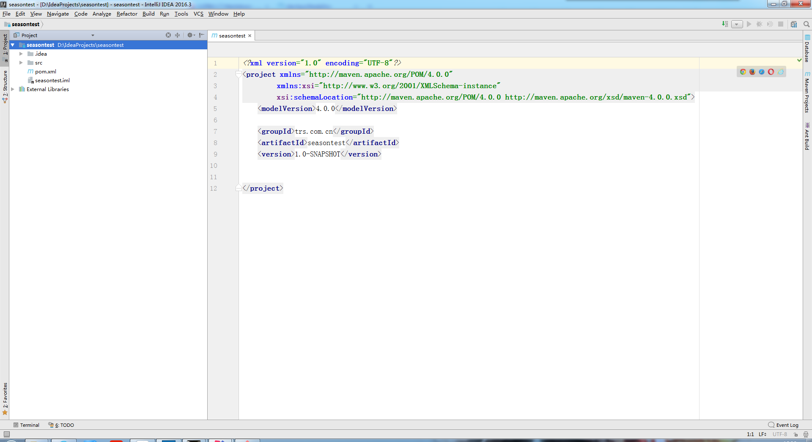
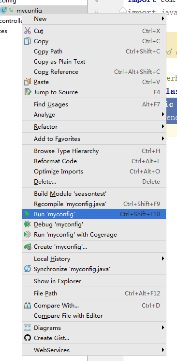
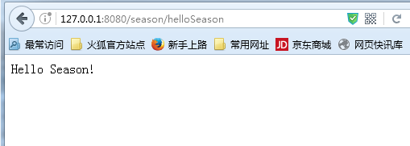
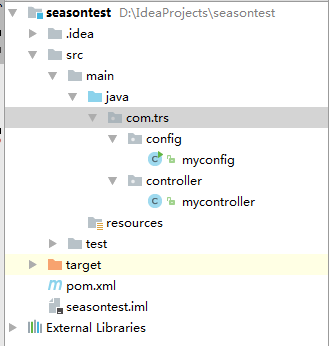

#开发环境搭建

我们使用Intellij Idea搭建我们的开发环境
###1创建一个Maven项目
   方法与我们之前提到的是一样的
   
**首先创建一个Maven项目**
   
   

   但是要注意在这里GroupId必须为trs.com.cn 而剩下的与以前一样 ArtifactId为项目名称 版本号默认

   
  
   确定项目名称及地址

   

   **配置Pom.xml**	

   项目创建成功之后我们找到pom.xml来进行配置

   

	<?xml version="1.0" encoding="UTF-8"?>
	<project xmlns="http://maven.apache.org/POM/4.0.0"
         xmlns:xsi="http://www.w3.org/2001/XMLSchema-instance"
         xsi:schemaLocation="http://maven.apache.org/POM/4.0.0 http://maven.apache.org/xsd/maven-4.0.0.xsd">
    <modelVersion>4.0.0</modelVersion>

    <groupId>trs.com.cn</groupId>
    <artifactId>season-test</artifactId>
    <version>1.0-SNAPSHOT</version>

    //打包格式
    <packaging>war</packaging>

    //season支持
    <parent>
        <artifactId>season-parent</artifactId>
        <groupId>trs.com.cn</groupId>
        <version>1.2</version>
    </parent>

    //season核心库依赖
    <dependencies>
        <dependency>
            <groupId>trs.com.cn</groupId>
            <artifactId>season-core</artifactId>
        </dependency>
    </dependencies>

    //打包插件
    <build>
        <finalName>SeasonTest</finalName>
        <plugins>
            <plugin>
                <groupId>org.springframework.boot</groupId>
                <artifactId>spring-boot-maven-plugin</artifactId>
            </plugin>
        </plugins>
    </build>

    //海尔maven仓库地址
    <repositories>
        <repository>
            <id>haier-maven-repository</id>
            <url>http://test.haier.com/nexus/content/groups/public/</url>
        </repository>
    </repositories>

	</project>

   这里使我们搭建开发环境必须的pom.xml配置

   **创建启动类**

   创建启动项目必须的启动类需要继承

   com.season.core.spring.SeasonApplication

   然后书写main方法

	package com.trs.config;

	import com.season.core.spring.SeasonApplication;
	import com.season.core.spring.SeasonRunner;

	/**
	 * Created by SONY on 2016/12/13.
 	*/
	public class myconfig extends SeasonApplication {
    public static void main(String[] args) {
        SeasonRunner.run(myconfig.class);
    }
	}
  
   run里面的参数是该启动类的名称

   **创建控制器**

   创建控制器类继续继承

   com.season.core.Controller

   然后需要在类上标注
	
	@ControllerKey("season")

   为控制器关键字

   然后可以书写方法 但是要注意作为方法是不能有参数的

	public void helloSeason(){
        renderText("Hello Season!");
    }

   这样我们的开发环境就搭建完成了，运行我们的启动类

   

   然后在浏览器输入地址就可以看到我们搭建成功的环境

   

   到这里我们开发环境就搭建完成了！ 项目结构如下

   