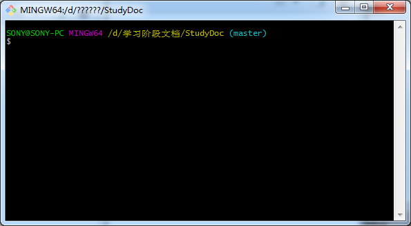
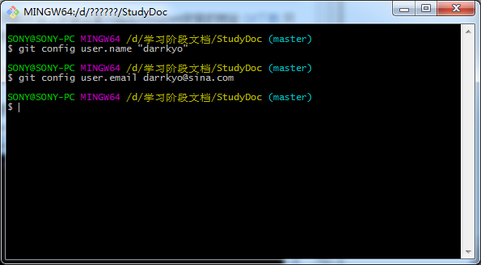
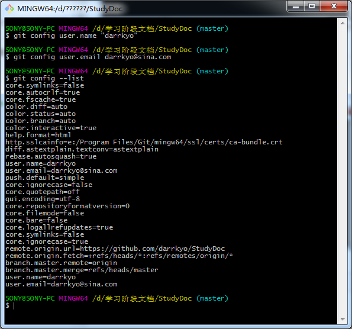
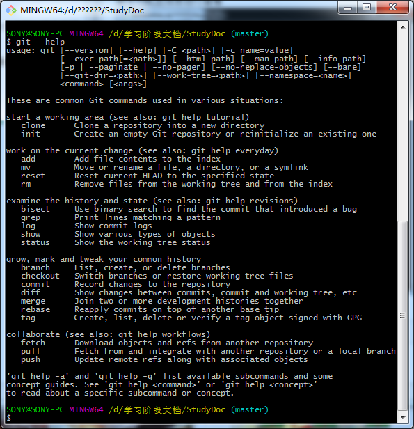
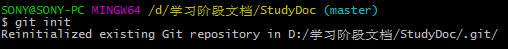
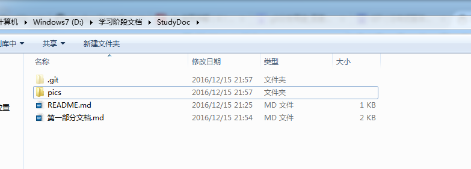

# Git的学习
##1.什么是Git
   Git是一个开源的分布式版本控制系统，可以有效、高速的处理从很小到非常大的项目版本管理。可以通过分支对已经稳定的master中的代码进行同时的开发和测试，并在分支稳定之后可以直接merge到master分支直接进行发布，极大的推动了合作开发和开源项目的制作。
##2.安装Git
   Git可以在不同的平台上安装这里只给出Windows安装的地址
   [Git下载](http://code.google.com/p/msysgit)
   只需要简单的安装就可以完成
##3.初次运行Git
   可以在开始里面点击Git Bash或者在你想要创建Git仓库的地方右键选择Git Bash Here进入git操作栏
   
   第一次进入Git时候需要对一些信息进行配置首先是需要对用户信息进行配置

	$ git config user.name "darrkyo" 

	$ git config user.email darrkyo@sina.com
   
   配置之后可以使用

	git config --list
   命令对配置信息进行查看 
   
   这里会显示出你所有的配置信息
   如果有疑问可以使用
	
	$git --help
   命令进行帮助菜单的调出
   
   到这里Git的准备就基本完成了 接下来就可以使用Git对代码进行保存了
##4创建Git本地仓库
   要对某个项目使用Git进行管理的话，需要在该项目所在的目录执行

	$ git init
   命令，执行之后就将该目录变成Git仓库，同时还会生成一个.git的目录
   
   由于我的目录已经创建完成，显示已经存在Git库而在文件夹内的.git文件夹是隐藏的，需要显示才可以看到
   
   这样Git本地的仓库就创建完成了
##5使用Git上传文件
   这里首先要说一下Git文件的几种状态
   Git的文件分为‍‍已提交（committed），已修改（modified）和已暂存（staged）三种状态，三种文件分别存在Git 的工作目录，暂存区域，以及本地仓库当中
  
   而Git的工作流程是如下的
   
   在工作目录中修改某些文件。

   对修改后的文件进行快照，然后保存到暂存区域。

   提交更新(commit)，将保存在暂存区域的文件快照永久转储到 Git 目录中。
