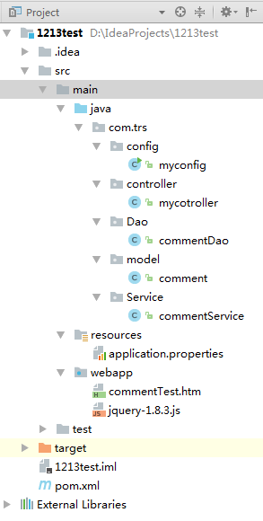
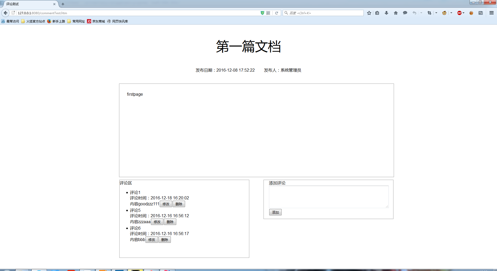
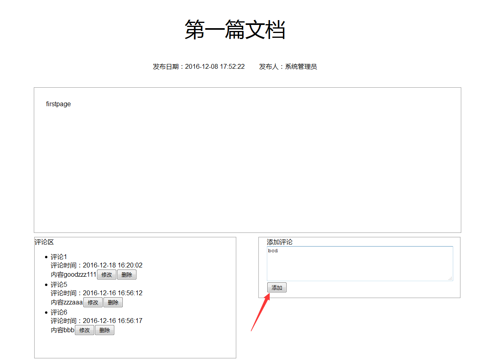
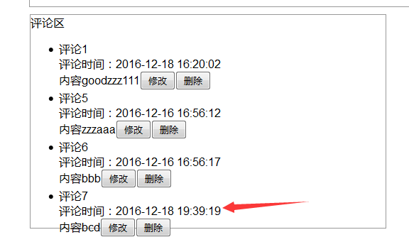
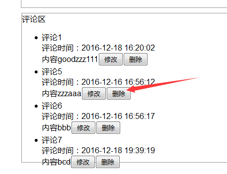
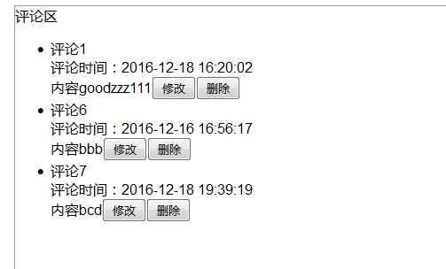
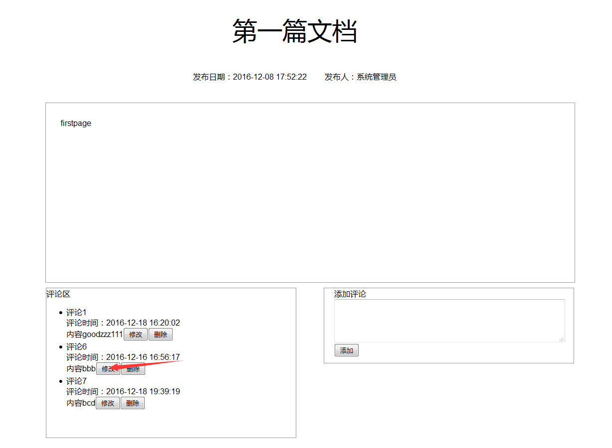
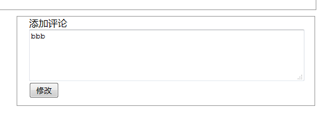
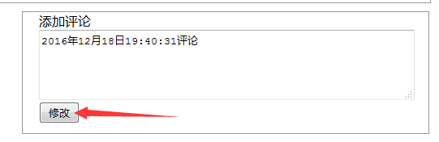
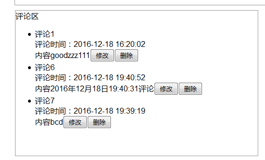

#对页面添加评论功能

   使用我们之前创建的Maven项目来对WCM生成细览页面进行修改，使其有简单的评论功能

   [Git Hub项目地址](https://github.com/darrkyo/TRScommenttest)：https://github.com/darrkyo/TRScommenttest

##数据库的链接

   需要在resource文件夹内新建一个application.properties文件并添加如下代码来实现对数据库的链接

	season.datasources[0].id=master
	season.datasources[0].url=jdbc:mysql://127.0.0.1:3306/trstest?useUnicode=true&characterEncoding=UTF-8&autoReconnect=true&failOverReadOnly=false&zeroDateTimeBehavior=convertToNull
	season.datasources[0].username=root
	season.datasources[0].password=123

##实体类

   实体类书写的时候需要

   添加@TableInfo注解 tableName来标注该实体类对应的表名 
   pkName标注该表的主键

   而@Transient注解则是告诉系统下面的代码不是数据库表中的数据

	package com.trs.model;
	
	import com.season.core.db.Pojo;
	import com.season.core.db.annotation.TableInfo;
	import com.season.core.db.annotation.Transient;

	/**
	 * Created by SONY on 2016/12/16.
 	*/
	@TableInfo(tableName =comment.TABLENAME,pkName = "id")
	public class comment extends Pojo<comment> {

    @Transient
    public final static String TABLENAME = "comment";

    @Transient
    public final static comment cm = new comment();
    //评论编号
    private Integer id;
    //产品id
    private String product_id;
    //产品评论
    private String comment;
    //评论日期
    private String date;

    public static com.trs.model.comment getCm() {
        return cm;
    }

    public Integer getId() {
        return id;
    }

    public void setId(Integer id) {
        this.id = id;
    }

    public String getProduct_id() {
        return product_id;
    }

    public void setProduct_id(String product_id) {
        this.product_id = product_id;
    }

    public String getComment() {
        return comment;
    }

    public void setComment(String comment) {
        this.comment = comment;
    }

    public String getDate() {
        return date;
    }

    public void setDate(String date) {
        this.date = date;
    }

    public static String getTABLENAME() {

        return TABLENAME;
    }

    public comment() {
    }

    public comment(Integer id, String product_id, String comment, String date) {
        this.id = id;
        this.product_id = product_id;
        this.comment = comment;
        this.date = date;
    }
	}

##Dao层

   Dao书写的时候注意不要忘记@Repository的标注

	package com.trs.Dao;

	import com.season.core.db.Dao;
	import org.springframework.stereotype.Repository;
	import com.trs.model.comment;

	import java.util.List;

	/**
	 * Created by SONY on 2016/12/16.
	 */
	@Repository
	public class commentDao {
    /**
     *添加评论
     * @param cm  评论对象
     * @return
     */
    public comment addComment(comment cm){
        return Dao.save(cm);
    }

    /**
     * 获得全部评论
     * @return
     */
    public List<comment> getComment(){
        return Dao.findAll(comment.class);
    }

    /**
     * 删除评论
     * @param commentId
     */
    public void deleteComment(int commentId){
        Dao.deleteById(comment.class,commentId);
    }

    /**
     * 更新，修改评论
     * @param cm
     */
    public void updateComment(comment cm){
       cm.update("comment","date");
    }
	}

##Service层

   Service书写时候需要标注

   @Service声明该类为Service

   @Autowired数据来源

	package com.trs.Service;

	import com.season.core.db.Dao;
	import com.trs.Dao.commentDao;
	import com.trs.model.comment;
	import 	org.springframework.beans.factory.annotation.Autowired;
	import org.springframework.stereotype.Service;

	import java.util.List;

	/**
	 * Created by SONY on 2016/12/16.
 	*/
	@Service
	public class commentService {

    @Autowired
    private commentDao cmdao;

    /**
     * 新增
     * @param cm  所要新增的对象
     * @return
     */
    public int addComment(comment cm){
        comment ls=cmdao.addComment(cm);
        if(ls!=null){
            return 1;
        }
        return -1;
    }

    /**
     * 获取所有
     * @return
     */
    public List<comment> getAllComment(){
        return cmdao.getComment();
    }

    /**
     * 删除
     * @param commentId 需要删除的id
     */
    public void deleteComment(int commentId){
        cmdao.deleteComment(commentId);
    }

    /**
     * 修改
     * @param cm 需要修改的对象
     */
    public void updateComment(comment cm){
        cmdao.updateComment(cm);
    }
 	}

##控制器

   控制器书写时候需要标注

   @ControllerKey("comment")声明控制器关键字

   @Autowired数据源

	package com.trs.controller;

	import com.season.core.Controller;
	import com.season.core.ControllerKey;
	import com.trs.Service.commentService;
	import com.trs.model.comment;
	import 	org.springframework.beans.factory.annotation.Autowired;

	import java.text.SimpleDateFormat;
	import java.util.Date;

	/**
 	* Created by SONY on 2016/12/13.
	 */
	@ControllerKey("comment")
	public class mycotroller extends Controller{

    @Autowired
    private commentService cmService;

    /**
     * 新增方法
     */
    public void addComment(){
        comment cm=new comment();
        String product_id=getPara("product_id");
        String comment=getPara("comment");
        System.err.println(product_id+":"+comment);
        String date= new SimpleDateFormat("yyyy-MM-dd HH:mm:ss").format(new Date().getTime());

        cm.setProduct_id(product_id);
        cm.setComment(comment);
        cm.setDate(date);

        Integer flag=cmService.addComment(cm);
        if(flag>0){
            setAttr("product_id",product_id);
            setAttr("comment",comment);
            setAttr("date",date);
            renderJson();
        }
    }

    /**
     * 获取全部
     */
    public void getAllComment(){
        renderJson("commentList",cmService.getAllComment());
    }

    /**
     * 删除方法
     */
    public void deleteComment(){
        int commentid=getParaToInt("id");
        cmService.deleteComment(commentid);
    }

    /**
     * 修改方法
     */
    public void updateComment(){
        comment cm=new comment();
        Integer product_id=getParaToInt("id");
        String comment=getPara("comment");
        String date= new SimpleDateFormat("yyyy-MM-dd HH:mm:ss").format(new Date().getTime());
        cm.setId(product_id);
        cm.setComment(comment);
        cm.setDate(date);
        cmService.updateComment(cm);
    }
	}

##WCM生成的细览页面

	<!DOCTYPE html>
	<html lang="en">
	<head>
    <meta charset="UTF-8">
    <title>评论测试</title>
    
    
	</head>
	<body>
	<h1 style="display:none" class="nav_hide">Title</h1>

	
第一篇文档

	

	发布日期：2016-12-08 17:52:22&nbsp;&nbsp;&nbsp;&nbsp;&nbsp;&nbsp;&nbsp;&nbsp;                                                     
	发布人：系统管理员
	

	

	
firstpage 

	

	

    评论区
    <ul id="comments">
    </ul>
	

	

    <form style="padding-left: 20px" id="addComment">
        <input type="hidden" id="product_id" value="a">
        添加评论 <textarea  id="comment" cols="55" rows="4"></textarea>
        <input type="button" id="submitbutton" value="添加">
    </form>
	

	</body>
	</html>

   由于还没有与WCM结合起来暂且只使用一个页面来进行演示

   项目结构如下

   

   打开浏览器进入项目，项目界面如下

   

   在右下角输入信息可以进行新增

   

   点击添加之后我们可以发现左边评论区的内容改变了，由于我没有仔细调整，可能界面会有点丑

   

   同样我们可以对评论进行删除，我们对第二个评论进行删除

   

   可以发现第二个评论被删除了

   

   最后我们还可以对评论进行修改

   

   现在我们对第二个评论进行修改，可以发现内容出现在右边的区域内

   

   然后我们对内容进行修改并点击修改

   

   我们就可以发现评论内容已经被修改

   

由于还没有与WCM绑定，接下来我会研究一下如何绑定，之后会补上